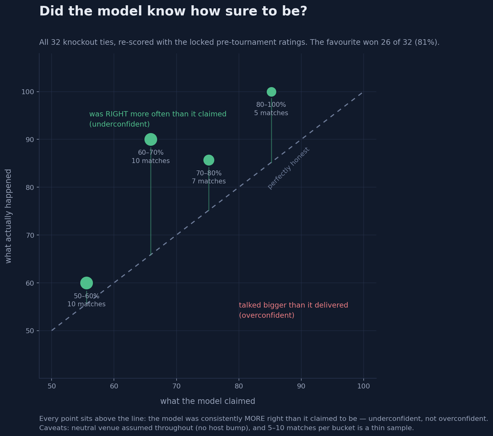

# FIFA WC 2026 - Baseline Model Evaluation

> Time-split: trained on 45,806 matches before 2023-01-01, graded on 3,475 held-out matches after (no leakage). Lower is better on all metrics. Actual test outcomes: home 47.0% / draw 23.0% / away 30.0%.

## Metrics: each model vs the dumb base-rate benchmark

Three models scored on the same 3,475 held-out matches. Base-rate ignores who is playing and
always predicts home 47% / draw 23% / away 30%. Poisson adds recency-weighted attack/defence
ratios; the finished model adds Elo on top. Lower is better; Improvement % is against base-rate.

| Metric | Base-rate | Poisson | **+ Elo (finished)** | Poisson improv. | **Elo improv.** |
|---|---|---|---|---|---|
| Brier | 0.6371 | 0.5703 | **0.520** | 10.5% | **18.4%** |
| Log loss | 1.0553 | 0.9625 | **0.884** | 8.8% | **16.2%** |
| RPS | 0.2299 | 0.1978 | **0.173** | 14.0% | **24.8%** |

**Verdict:** the finished model beats a team-blind benchmark by **16–25%** — it has learned real
signal. Elo is the jump from the 9–14% Poisson baseline. RPS 0.173 is in the normal band for a
solid amateur football model; not elite, but a real improvement over every simpler version below it.

## Calibration (predicted home-win prob vs actual home-win rate)

| Bin matches | Mean predicted home | Actual home rate | Gap (actual - predicted) |
|---|---|---|---|
| 25 | 0.065 | 0.040 | -0.025 |
| 167 | 0.162 | 0.102 | -0.060 |
| 635 | 0.258 | 0.208 | -0.050 |
| 1100 | 0.352 | 0.405 | +0.053 |
| 940 | 0.445 | 0.580 | +0.134 |
| 436 | 0.540 | 0.768 | +0.229 |
| 132 | 0.640 | 0.909 | +0.269 |
| 28 | 0.735 | 0.929 | +0.193 |
| 11 | 0.844 | 1.000 | +0.156 |
| 1 | 0.907 | 1.000 | +0.093 |

**Reading it:** a positive gap means the model UNDER-predicted home wins - expected, because the model has no home-advantage term. This is the single clearest motivation for adding one.

---

## Out-of-sample: the WC 2026 knockout rounds

The held-out split above is the honest lab measurement. This is the field one - all 32
knockout ties of the actual tournament, re-scored with the **locked pre-tournament
ratings** on the matchups that actually occurred. Knockouts must produce a winner, so the
draw probability is split evenly between the two sides.

Regenerate with `python 15_calibration.py`.

**Reading it:** the favourite went through in **26 of 32** ties (81%). Every bucket sits
*above* the diagonal - the model was consistently more right than it claimed to be, i.e.
**underconfident**, not overconfident. The ten ties it rated 50-60% went **6-4** its way.

**Caveats, stated plainly:** neutral venue is assumed throughout (no host bump), and 5-10
matches per bucket is a thin sample - a single flipped result moves a point visibly. This
is directional evidence, not a calibration certificate.